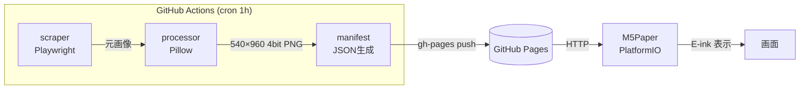

# m5paper-favimagegallary

M5Paper で自分の X (Twitter) ふぁぼ最新画像を 1 時間ごとに自動表示するサーバレス画像ギャラリー。

GitHub Actions (cron 1h) でスクレイピング・画像処理・マニフェスト生成を行い、GitHub Pages で配信。M5Paper はその URL から画像を取得して E-ink に表示する。サーバ料金ゼロ。

---

## 構成図



---

## ディレクトリ構成

```
m5paper-favimagegallary/
├── README.md
├── LICENSE
├── .gitignore
├── server/
│   ├── scraper/        # Playwright スクレイパー (#2)
│   ├── processor/      # 画像加工 Pillow (#3)
│   ├── manifest/       # manifest JSON 生成・公開ロジック (#4)
│   ├── tests/          # pytest
│   └── pyproject.toml  # 依存関係管理
├── firmware/
│   ├── platformio.ini  # PlatformIO プロジェクト設定
│   ├── src/            # C++ ソース
│   ├── data/           # SD 配置サンプル
│   │   └── config.example.json
│   └── README.md
└── .github/
    └── workflows/
        └── update-gallery.yml  # 1h 毎の cron (#4)
```

---

## 必要な GitHub Secrets

| Secret 名 | 説明 |
|---|---|
| `TWITTER_USERNAME` | X (Twitter) のユーザー名（`@` なし） |
| `TWITTER_AUTH_TOKEN` | ブラウザ Cookie の `auth_token` 値 |
| `TWITTER_CT0` | ブラウザ Cookie の `ct0` 値 |

### 認証 Cookie のエクスポート手順

1. ブラウザで [https://x.com](https://x.com) にログインする
2. DevTools を開く（F12 または右クリック → 検証）
3. **Application** タブ → **Cookies** → `https://x.com` を選択
4. `auth_token` の値をコピーして `TWITTER_AUTH_TOKEN` シークレットに登録
5. `ct0` の値をコピーして `TWITTER_CT0` シークレットに登録

> **注意**: Cookie は定期的に失効します。`401` / 認証エラーが出た場合は上記手順で再取得・更新してください。

---

## M5Paper 側 `config.json` フォーマット

SD カードの `/config.json`（または `firmware/data/config.example.json` を参照）:

```json
{
  "wifi_ssid": "YOUR_WIFI_SSID",
  "wifi_password": "YOUR_WIFI_PASSWORD",
  "manifest_url": "https://<username>.github.io/m5paper-favimagegallary/manifest.json",
  "update_interval_sec": 3600
}
```

| キー | 説明 |
|---|---|
| `wifi_ssid` | Wi-Fi SSID |
| `wifi_password` | Wi-Fi パスワード |
| `manifest_url` | GitHub Pages 上の `manifest.json` URL |
| `update_interval_sec` | 画像更新間隔（秒）。デフォルト 3600 = 1 時間 |

---

## 開発・デプロイ手順

### サーバサイド (Python)

```bash
# 依存インストール
cd server
pip install -e ".[dev]"

# スクレイパー単体実行
python -m scraper

# テスト
pytest tests/
```

### ファームウェア (PlatformIO)

```bash
cd firmware
# ビルド
pio run
# M5Paper に書き込み
pio run --target upload
```

### GitHub Pages の設定

1. リポジトリの **Settings → Pages** を開く
2. Source に **`gh-pages` ブランチ**（`/` ルート）を指定して保存
3. GitHub Actions の `update-gallery.yml` が自動で `gh-pages` へ push します

---

## 既知の制約

- **likes の非公開化**: X (Twitter) は 2024 年以降、他ユーザーのいいねを非公開化。本プロジェクトでは Cookie 認証で **自分自身の** likes ページを読み取るため引き続き動作するが、セッションが切れると手動で Cookie 更新が必要。
- **Cookie 認証の脆弱性**: `auth_token` / `ct0` は強力なセッション Cookie です。GitHub Secrets に格納し、絶対に公開しないでください。
- **レートリミット**: 頻繁な実行は X 側でブロックされる可能性があります。デフォルトの 1 時間間隔を推奨します。
- **E-ink の残像**: M5Paper の E-ink ディスプレイは完全リフレッシュでも若干の残像が残る場合があります。

---

## ライセンス

MIT License — 詳細は [LICENSE](./LICENSE) を参照。
